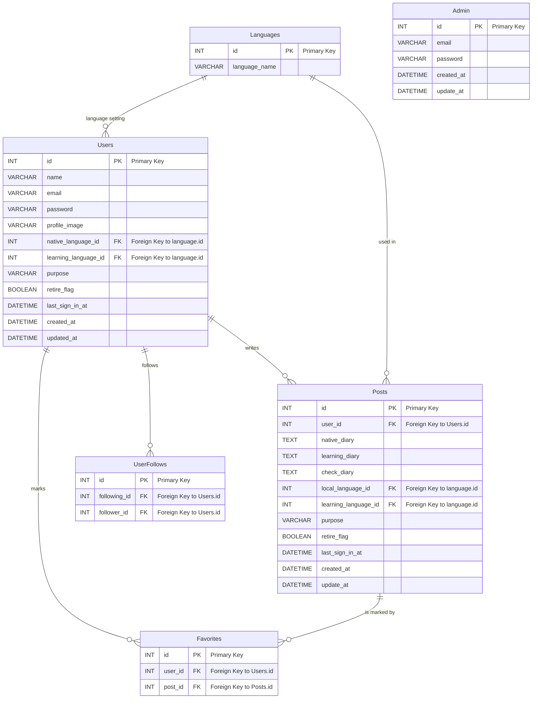
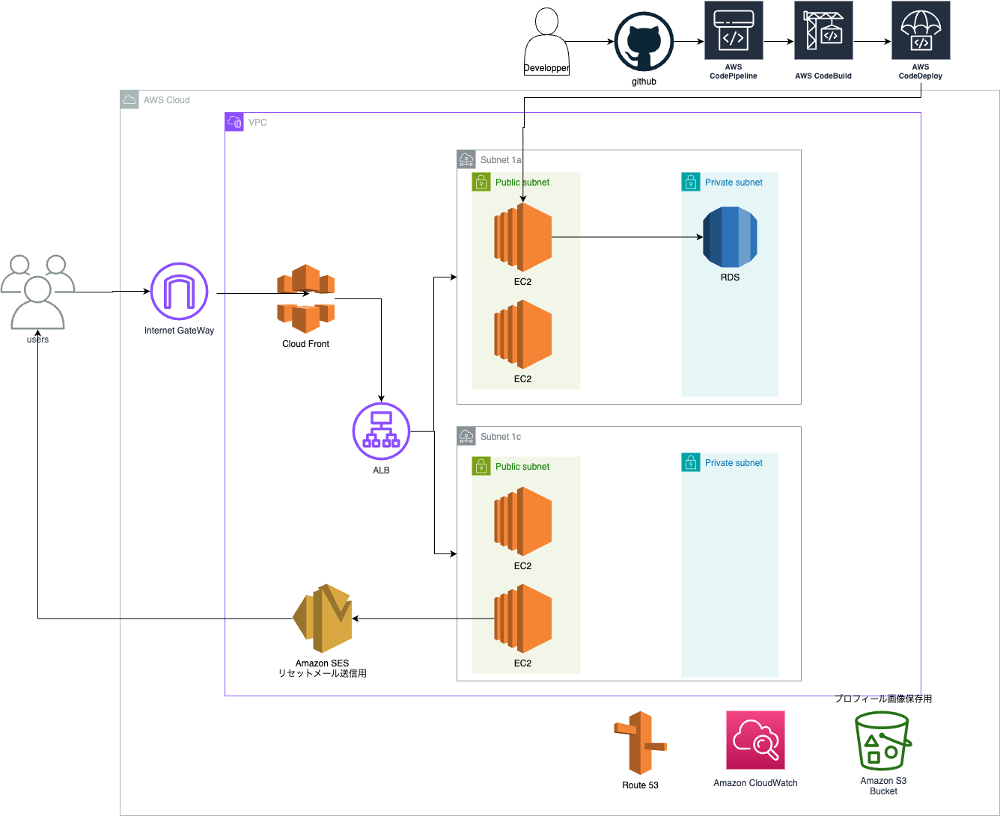

# 作るもの

ランガリー
「Language」（言語）と「Diary」（日記）を組み合わせた造語です。
言語学習アプリケーションです。

## なぜ作るか？

このアプリは、言語学習の一環として日記を書くことの効果を活用します。YouTuber の影響で英語日記の作成を推奨していることに興味を持ち始め、実際に友人たちと第一言語で日記を書き、それを学習中の言語に翻訳し、さらに ChatGPT で添削を受けるというプロセスを経て、多くの学びと発見があることを実感しました。
この経験は、言語学習における新しい方法として、とても面白く刺激的でした。
しかし、notion を使用して交流をしていたため、無料枠はすぐに使い切ってしまいました。
そのうえ、クローズドな環境になってしまうので、特定の友人としか使えない手法でした。
なので、学習したい多くの人が気軽に使えるアプリを開発したいということがきっかけです。
また、個人的なポートフォリオの充実もこのアプリ開発の動機の一つです。過去に楽しく体験したモブプログラミングの経験も生かし、チームで楽しみながら開発を進めます。

そして、このアプリを通して、色々な国の人々の言語学習に役立ち、日記の作成を通して相互理解やお互いの尊重に繋がることに寄与することを望んでいます。

## プロセス

自分の言語で日記を書く -> 学習している言語で日記を書く -> OpenAI API で添削してもらう

# ランガリー アプリ開発 - 技術スタック

## フロントエンド

-   React.js
-   TailwindCSS
-   TypeScript

## バックエンド

-   Laravel
<!-- - Laravel Sanctum (認証用) -->

## データベース

-   AWS Aurora
<!-- - Redis (セッション管理・キャッシュ用) -->

## API 通信

-   OpenAI API
-   AWS API Gateway
<!-- - AWS Lambda -->

## 認証

-   Laravel Breeze
-   Laravel Socialite

## テスト

-   PHPUnit
<!-- - Laravel Dusk -->

## コンテナ

-   Docker

## インフラ

-   AWS (Amazon Web Services)
    -   EC2

## バージョン管理

-   GitHub

## ワイヤーフレーム

-   Figma

## ツール

Postman

## ER 図

## AWS アーキテクチャ

